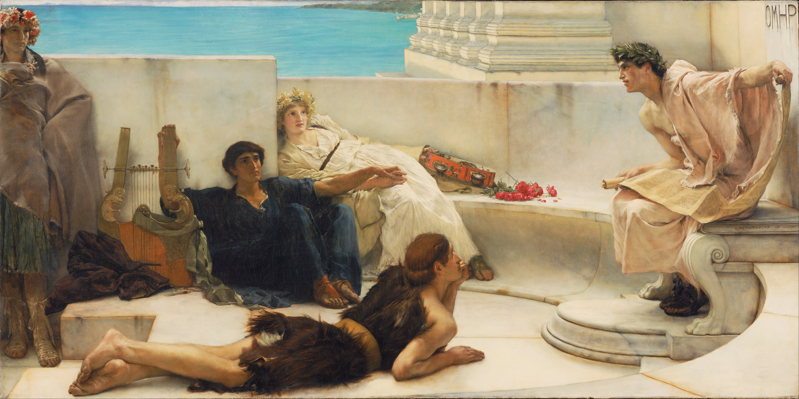

# Greek Epic - Tufts University, Fall 2025

By Lawrence Alma-Tadema

[Google Cultural Institute](https//www.google.com/culturalinstitute/asset-viewer/fAFfW9CzajZAaA)
Public Domain [Source](https://commons.wikimedia.org/w/index.php?curid=21886584)

## Details

Time: M 6–8:30pm    
Location: Eaton Hall 201    
Instructor: Charles Pletcher (charles.pletcher@tufts.edu)    
Instructor Office Hours: TTh 5-6pm or by appointment (https://cal.com/pletcher)    

## Prerequisites

Completion of Greek 3 or higher, or graduate standing

## Description

This course prepares students to read ancient Greek epic (Homer, Hesiod, and —
vocabulary notwithstanding — Apollonius). Beginning with a quick review of basic
grammar and syntax, we will explore the literary, cultural, historical, and
performance context of Homeric epic.

Homeric Greek is peculiar: a _Künstsprache_ mixing elements of various Greek
dialects in order to broaden its audience, it bears some similarities to the
contemporary "mid-Atlantic accent" that populates news stations. At the same
time, it is highly formulaic, lending itself well to the oral performance
culture that both supported and was supported by it.

In this iteration of the course, we will read _Iliad_ 6, which contains the
emotionally tense gift exchange between Glaucos and Diomedes, as well as the
epic's only scene of true domesticity, when Hector briefly reunites with
Andromache and their infant son Astyanax. Supplementary readings for this unit
concern the historical and anthropological backgrounds of gift exchange and the
roles of women in archaic Greek society.

Subsequently, we will read books 17 and 18 of the _Odyssey_. These books concern
Odysseus's return to Ithaca and his entry into the palace. In addition to the
primary text, we will read Eric Auerbach's famous essay on Eurykleia's
recognition of Odysseus's scar, as well as texts on class and social status in
antiquity.

In addition to gaining essential skills for independent Greek reading, students
will also learn how to use modern tools like treebanks and LLMs to complement —
**not supplement** — their studies.

## Learning outcomes

After completing this course, students will be able to

1. Read Homeric Greek with occasional help from a lexicon or other supplementary material
2. Discuss the history of oral poetry in broad terms
3. Discuss the composition history of ancient epic
4. Understand the basic contours of the history of Homeric reception
5. Interpret episodes from Homeric poetry with attention to their cultural and performance contexts

## Required Textbooks

- Graziosi, Barbara and Johannes Haubold, eds. 2010. _Homer:_ Iliad
  _Book VI_. Cambridge: Cambridge UP. ISBN: 9780521878845
- Steiner, Deborah, ed. 2010. _Homer_: Odyssey _Books XVII and
  XVIII_. Cambridge: Cambridge UP. ISBN: 9780521677110

## [Reading schedule](./schedule.md)

See the file located at [schedule.md](./schedule.md) for the most up-to-date schedule.

## Grading

- 30% in-class participation and translation
- 15% Midterm 1
- 15% Midterm 2
- 20% Final paper
- 20% Digital commentary

### 30% in-class participation and translation

Please come to class prepared to translate the assigned reading. It is acceptable
(and expected) to bring a "crib sheet," i.e., a notebook with translations of
words and phrases written out. Try not to write out the entire translation, and
definitely don't copy directly from another translation.

We'll review translation strategies in the first few sessions.

Keep in mind that the order in which you will have to translate will change from
class to class, so make sure to do _all_ of the reading.

In addition to translation, you might be expected to answer questions about syntax
and grammar.

### 15% each: Midterms

Each midterm will consist of two or three passages that we have translated together
in class, as well as one "unseen" passage for sight-translation.

Translations will be graded on lexical and grammatical accuracy. I'm less worried
about your English, but please try to keep your translations legible.

### 20% Final paper

Towards the end of the semester, you'll each write a 5–7-page paper on a topic of
your choosing. (I will provide some suggestions.) We'll decide on precise grading
criteria as a class, but in general you should expect to demonstrate your ability
to read and accurately interpret Homer in the original Greek, making use of
secondary literature as appropriate.

I will provide a detailed rubric along with example prompts.

### 20% Digital commentary

We will be writing a collaborative digital commentary together as a class, and
each of you will be responsible for contributing several glossae.

The goal is partly to give you another opportunity to review the material and
partly to provide an opportunity for you to work with digital methods and
technologies. We'll start by discussing how to use a digital treebank, and
we will also explore ways to use large language models (LLMs) and other
"Generative AI" tools to aid in your explication of key passages of the text.

## Statement on AI

(Adapted from ["Artificial Intelligence"](https://provost.tufts.edu/celt/online-resources/artificial-intelligence/ai-syllabus-statements/) by the Tufts' Center for the Enhancement of Learning and Teaching)

This course discourages the use of Generative Artificial Intelligence (GAI)
for translation assignments. At the same time, the course also provides
opportunities to explore the use of GAI in supplementing or augmenting our
abilities to engage with and understand Homeric song.

To this end, we will adhere to the following guidelines:

1. **NEVER** submit AI-generated work as your own. To do so is considered a violation of Tufts' [Academic Integrity Policy] (https://students.tufts.edu/community-standards/academic-integrity/academic-integrity-overview).
2. Familiarize yourself with the limitations of GAI tools. These tools all come with inherent biases, and they all make mistakes. Be aware that no matter how "confident" the AI seems, it does not actually "know" anything.
3. Cite all uses of AI. See suggestions from the [Chicago Manual of Style](https://www.chicagomanualofstyle.org/qanda/data/faq/topics/Documentation/faq0422.html) and the [MLA](https://style.mla.org/citing-generative-ai/).
4. In addition to citation, please identify _how_ the GAI contributed to your work. (Your explanation need not be more than a sentence or two.)
5. If have any questions, please contact me by email, during office hours, or in class.

## Policies

### Attendance

Emergencies arise. Everyone is permitted one unexcused absence. If you will need to miss additional
classes, please let me know as soon as possible. Unexcused absences will count as a 0 for that day's
translation grade.

### Late work

Late work will not be accepted. Extensions are handled on a case-by-case basis, but are
generally pretty easy to obtain if you provide the instructor with sufficient notice.

### Computer use

Please only use your computer (or tablet or phone) during designated times in class. Importantly,
please **do not** use your computer when translating.

### Food and drink

Please eat only during breaks. (We'll have one about halfway through each class.)

Otherwise, please stay hydrated.

### Sharing

This course is designed for everyone to feel comfortable participating in discussion, asking
questions, learning, and facilitating the learning of others.  In order for that atmosphere to be
maintained, the recordings of our conversations will only be shared with the enrolled students in
the class (not posted publicly) and it is prohibited for any of us who have access to the video
to share it outside the course. Similarly, I have specifically designed the exams, handouts, and
lectures for the people who are enrolled in the course this term and those may not be shared outside
this course. All of this content is freely available on GitHub under a Creative Commons license —
attribution is all that is required.

## Resources

### Religious accommodations

Tufts University faculty, staff, and administration highly value and acknowledge the religious diversity of its student body. Students seeking religious accommodations related to their holy days are encouraged to collaborate with faculty to make arrangements during the first week of each semester. Consult the [Multifaith Calendar](https://chaplaincy.tufts.edu/multifaith-calendar/) for upcoming holidays, links to the University Religious Accommodations Policy, and members of the University Chaplaincy who are available to respond to questions on religious observances.

### Accommodations for students with disabilities

Tufts is committed to providing equal access and support to all qualified students through the provision of reasonable accommodations. If you have a disability that requires reasonable accommodations, contact the StAAR Center at StaarCenter@tufts.edu or 617-627-4539. Please be aware that accommodations cannot be enacted retroactively, making timeliness a critical aspect for their provision.

### Academic support at the StAAR Center

The StAAR Center offers a variety of FREE resources to all students. Students may make an appointment to work on any writing-related project or assignment, attend subject tutoring in a variety of disciplines, or meet with an academic coach to hone skills like time management and navigating procrastination. Students can make an appointment for any of these services by visiting https://students.tufts.edu/staar-center.

### Student support, including mental health

As a student, there may be times when personal stressors or difficulties interfere with your academic performance or well-being. The Dean of Student Affairs Office offers support and care to undergraduates and graduate students who are experiencing difficulties, and can also aid faculty in their work with students. In addition, through Tufts’ Counseling and Mental Health Service (CMHS) students can access mental health support 24/7, and they can provide information on additional resources. CMHS also provides confidential consultation, brief counseling, and urgent care at no cost for all Tufts undergraduates as well as for graduate students who have paid the student health fee. To make an appointment, call 617-627-3360. Please visit the CMHS website: http://go.tufts.edu/Counseling to learn more about their services and resources.

